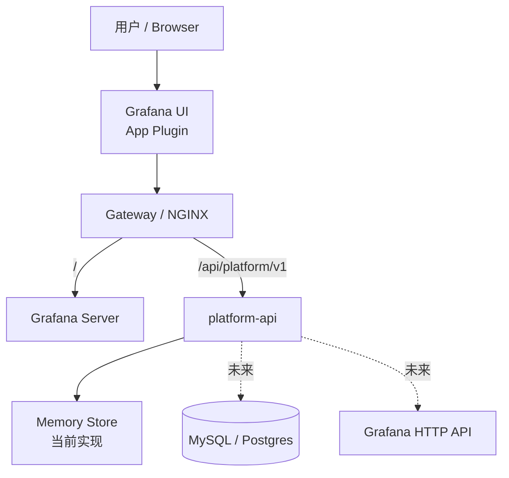
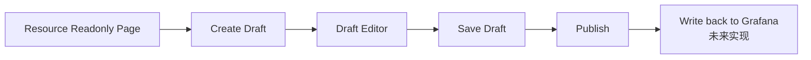
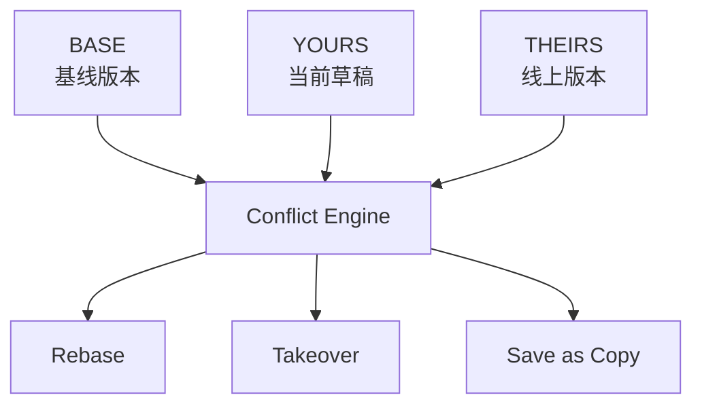

# Grafana Control Plane 架构图

## 1. 总体架构

## 2. 前端受控编辑链路

## 3. 冲突处理链路

## 4. 模块边界

| 模块 | 当前职责 |
|------|----------|
| Grafana | Dashboard 展示、插件容器、用户入口 |
| App Plugin | Resource 只读页、Draft 编辑页、Diff/Conflict UI |
| Gateway | 路由转发，统一把 `/api/platform/v1` 转到 platform-api |
| platform-api | Draft 生命周期、Panel 编辑保存、Conflict 数据输出 |
| Store | 当前为内存实现，后续替换为 MySQL / Postgres |

## 5. 当前实现状态

- 已实现：Draft workflow、Panel editor、受控只读 definition、基础 conflict UI、One-click deploy
- 未实现：持久化存储、真正 publish 回写 Grafana、RBAC 封禁原生 edit、审批流
